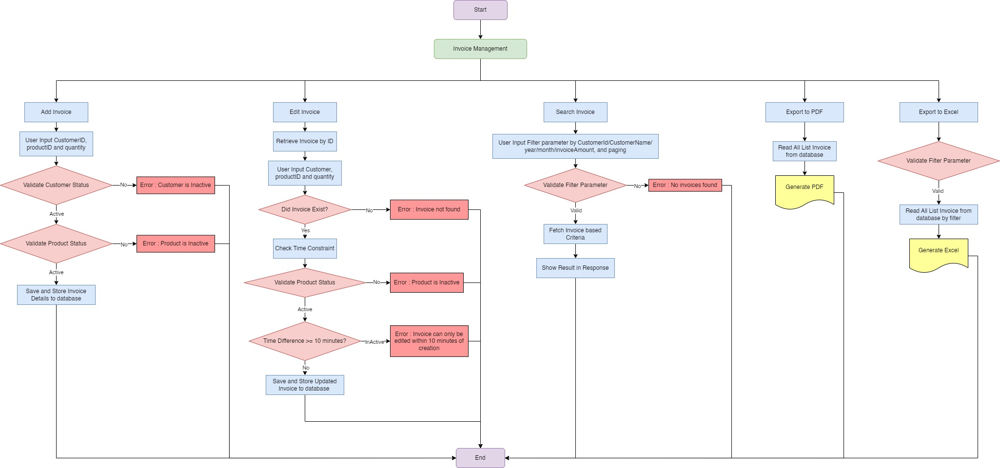

## Midterm Exam Group 1: POS Management API

### Overview
This project is a simple web application built using Spring Boot for managing customers, products and invoices. It provides basic CRUD functionalities (Create, Read, Update, Delete) for entities stored in a MySQL database and some other functionalities.

### Technologies Used
- **Spring Boot**: Framework for creating and running Spring-based applications.
- **MySQL**: Open-source relational database management system.
- **Swagger (Springdoc OpenAPI)**: For API documentation.
- **Apache POI**: Java API for Microsoft documents.
- **Lombok**: Java library to reduce boilerplate code.
- **iTextPDF**: Java library for creating and manipulating PDF documents.

### Prerequisites
- Java 21 or higher
- Maven 3.6.0 or higher
- MySQL 8.0 or higher

### Project Structure

### Business Flow Diagram

### Class Diagram

### Running the Application
1. Create MySQL database named midtermg1, configure the username and password in the `application.properties`
2. Execute `mvn spring-boot:run` in the project directory
3. The application will be accessible at `http://localhost:8080`

### API List
When the app is running, the API list can be seen at `http://localhost:8080/swagger-ui/index.html`

### Insert Inital Data
For initial data, use [init.sql](file%2Finit.sql)

#
### API List
### Customer APIs
1. **Get Customer List:**
   - Method: `GET`
   - URL: `http://localhost:8080/api/v1/customers`
   - Params: `page`, `size`, `keyword` (optional)

2. **Get Customer by ID:**
   - Method: `GET`
   - URL: `http://localhost:8080/api/v1/customers/{id}`
   - Replace `{id}` with a specific customer ID.

3. **Add Customer:**
   - Method: `POST`
   - URL: `http://localhost:8080/api/v1/customers`
   - Body: Select `raw` and `JSON` format, then provide the customer data as JSON.

4. **Edit Customer:**
   - Method: `PUT`
   - URL: `http://localhost:8080/api/v1/customers/{id}`
   - Replace `{id}` with the specific customer ID.
   - Body: Select `raw` and `JSON` format, then provide the updated customer data as JSON.

5. **Activate Customer:**
   - Method: `PUT`
   - URL: `http://localhost:8080/api/v1/customers/activate/{id}`
   - Replace `{id}` with the specific customer ID.

6. **Deactivate Customer:**
   - Method: `PUT`
   - URL: `http://localhost:8080/api/v1/customers/deactivate/{id}`
   - Replace `{id}` with the specific customer ID.

### Invoice APIs
1. **Add Invoice:**
   - Method: `POST`
   - URL: `http://localhost:8080/api/v1/invoices`
   - Body: Select `raw` and `JSON` format, then provide the invoice data as JSON.

2. **Edit Invoice:**
   - Method: `PUT`
   - URL: `http://localhost:8080/api/v1/invoices/{id}`
   - Replace `{id}` with the specific invoice ID.
   - Body: Select `raw` and `JSON` format, then provide the updated invoice data as JSON.

3. **Get Invoice by ID:**
   - Method: `GET`
   - URL: `http://localhost:8080/api/v1/invoices/{id}`
   - Replace `{id}` with the specific invoice ID.

4. **Get All Invoices:**
   - Method: `GET`
   - URL: `http://localhost:8080/api/v1/invoices`
   - Params: `page`, `size`

5. **Add Invoice Product:**
   - Method: `POST`
   - URL: `http://localhost:8080/api/v1/invoices/products`
   - Body: Select `raw` and `JSON` format, then provide the invoice product data as JSON.

6. **Search Invoices by Criteria:**
   - Method: `GET`
   - URL: `http://localhost:8080/api/v1/invoices/search`
   - Params: `customerId`, `customerName`, `year`, `month`, `invoiceAmountCondition`, `invoiceAmount`, `page`, `size`

7. **Export Invoices to PDF:**
   - Method: `GET`
   - URL: `http://localhost:8080/api/v1/invoices/export-pdf`

8. **Export Invoices to Excel:**
   - Method: `GET`
   - URL: `http://localhost:8080/api/v1/invoices/export-excel`
   - Params: `customerId`, `customerName`, `year`, `month`, `invoiceAmountCondition`, `invoiceAmount`

9. **Get Revenue Report:**
   - Method: `GET`
   - URL: `http://localhost:8080/api/v1/invoices/report`
   - Params: `year`, `month`, `day`

### Product APIs
1. **Get All Products:**
   - Method: `GET`
   - URL: `http://localhost:8080/api/v1/products`
   - Params: `page`, `size`, `search`, `sortBy`, `sortDir`

2. **Add Product:**
   - Method: `POST`
   - URL: `http://localhost:8080/api/v1/products`
   - Body: Select `raw` and `JSON` format, then provide the product data as JSON.

3. **Edit Product:**
   - Method: `PUT`
   - URL: `http://localhost:8080/api/v1/products/{id}`
   - Replace `{id}` with the specific product ID.
   - Body: Select `raw` and `JSON` format, then provide the updated product data as JSON.

4. **Import Products:**
   - Method: `POST`
   - URL: `http://localhost:8080/api/v1/products/import`
   - Body: Select `form-data` and add a key `file` with type `file`, then upload the file.

5. **Activate Product:**
   - Method: `PUT`
   - URL: `http://localhost:8080/api/v1/products/activate/{id}`
   - Replace `{id}` with the specific product ID.

6. **Deactivate Product:**
   - Method: `PUT`
   - URL: `http://localhost:8080/api/v1/products/deactivate/{id}`
   - Replace `{id}` with the specific product ID.