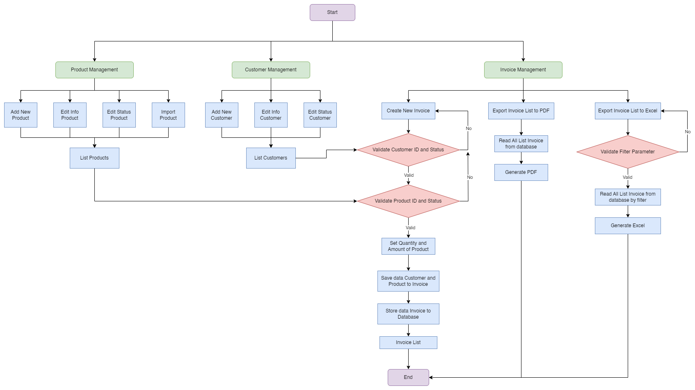
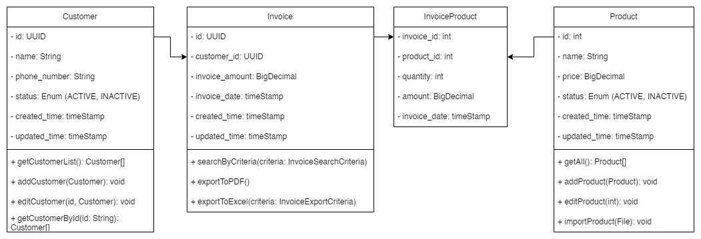

## Midterm Exam Group 1: POS Management API

### Overview
This project is a simple web application built using Spring Boot for managing customers, products and invoices. It provides basic CRUD functionalities (Create, Read, Update, Delete) for entities stored in a MySQL database and some other functionalities.

### Technologies Used
- **Spring Boot**: Framework for creating and running Spring-based applications.
- **MySQL**: Open-source relational database management system.
- **Swagger (Springdoc OpenAPI)**: For API documentation.
- **Apache POI**: Java API for Microsoft documents.
- **Lombok**: Java library to reduce boilerplate code.
- **iTextPDF**: Java library for creating and manipulating PDF documents.

### Prerequisites
- Java 21 or higher
- Maven 3.6.0 or higher
- MySQL 8.0 or higher

### Project Structure

### Business Flow Diagram

### Class Diagram

### Running the Application
1. Create MySQL database named midtermg1, configure the username and password in the `application.properties`
2. Execute `mvn spring-boot:run` in the project directory
3. The application will be accessible at `http://localhost:8080`

### API List
When the app is running, the API list can be seen at `http://localhost:8080/swagger-ui/index.html`

### Insert Inital Data
For initial data, use [init.sql](file%2Finit.sql)